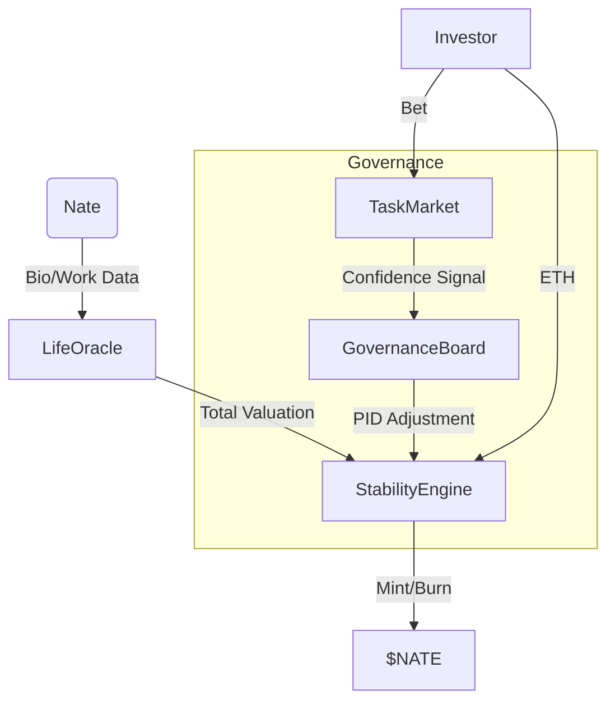

# System Architecture

The Nate Protocol is a cyber-physical system linking real-world human productivity metrics to an on-chain stability mechanism.

## High-Level Overview

## Core Components

### 1. Stability Engine
The "Central Bank" of the protocol. It enforces the backing of the currency.
- **Collateral Ratio (CR)**: Must appear > 150%.
- **Formula**: `CR = (HumanCapital + LiquidETH) / TotalSupply`
- **Minting**: Allowed only if `CR` remains above target after minting.
- **Redemption**: $NATE is always redeemable for $1.00 USD worth of ETH from the liquid reserve.

### 2. Life Oracle
Aggregates off-chain data points into a single "Total Value" metric (USD denominated).
- **Time Value**: 24h * Hourly Rate.
- **Skill Value**: GitHub activity, deployments.
- **Social Value**: Reach, engagement.
- **Verification**: Uses **Chainlink Functions** to fetch and verify data from authorized APIs.

### 3. Governance Board (PID Controller)
Unlike DAO voting, governance is Algorithmic.
- **Mechanism**: PID Controller (Proportional-Integral-Derivative).
- **Input**: Market Confidence (from Prediction Market odds).
- **Output**: Minting Capacity Adjustment.
- **Logic**: 
    - If Market Confidence drops, `Kp` term brakes minting.
    - If Confidence is stable high, `Ki` term accumulates to boost supply cap.

### 4. Task Market
A parimutuel prediction market.
- **Purpose**: Signals "Market Confidence" to the Governance Board.
- **Mechanics**: Users bet $NATE on boolean outcomes (e.g. "Will Nate ship feature X?").
- **Payout**: Winners split the losers' pool pro-rata.

## Security
- **MultiSig**: Critical contract upgrades are protected by a 2-of-3 Gnosis Safe (or custom MultiSigGovernance).
- **Timelock**: Governance actions have a 24-hour delay.
